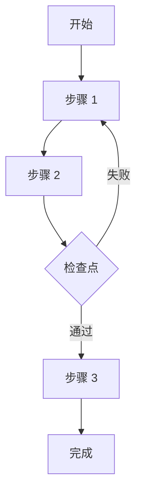

# 📚 AI Agent 知识传承通用模板

> 用于系统性地总结和传承复杂任务的实现经验
>
> **适用场景**: 完成复杂任务后，希望其他 AI Agent 能够快速复现你的工作，避免重复踩坑

---

## 使用方法

### 快速使用

```
为其他 AI Coding Agent 创建一份完整的 [任务/功能] 实现指南文档。

[任务名称]: _______________
[项目背景]: _______________

（后面使用下方的完整模板）
```

### 何时使用

在以下情况下使用此模板：
- ✅ 完成了一个复杂的、可能重复的任务
- ✅ 踩过多个坑，有很多经验教训
- ✅ 希望其他 Agent 能快速复现你的工作
- ✅ 任务有明确的模式和步骤

---

## 完整 Prompt 模板

```markdown
为其他 AI Coding Agent 创建一份完整的 [任务/功能] 实现指南文档。

## 要求

### 文档目标
- **目标读者**: 其他 AI Coding Agents（Claude Code、Cursor、GitHub Copilot 等）
- **核心原则**: 让后来者能够直接站在你的肩膀上，避免重复踩坑
- **文档位置**: `docs-for-ai/[TASK_NAME]_GUIDE.md`

### 必须包含的内容

#### 1. 工具与方法（最重要！）
- **你实际使用的所有工具**（不是理论上可以用的，而是你真正用过的）
  - 每个工具的具体用法、参数说明
  - 真实的调用示例（带返回结果）
  - 什么时候用哪个工具
- **完整的分析流程**
  - 第一步做什么、第二步做什么...
  - 每一步的验证方法
  - 实战案例展示（用真实数据）

#### 2. 实现模式
- **识别出的所有模式**（至少 3-4 种）
  - 每种模式的特征
  - 适用场景
  - 代码示例对比
- **关键决策点**
  - 什么情况下选择哪种模式
  - 验证问题清单

#### 3. 逐步实现指南
- **详细的步骤分解**（至少 5-7 步）
  - 每一步的目标
  - 完整的代码模板
  - 验证检查点
  - 常见错误处理
- **文件变更清单**
  - 需要修改哪些文件
  - 每个文件要改什么

#### 4. 踩过的坑（关键！）
- **所有你遇到的问题**
  - 错误的做法示例
  - 正确的做法示例
  - 为什么会出错
  - 如何避免
- **至少记录 5-6 个陷阱**

#### 5. 质量保证
- **完整的检查清单**（至少 15 项）
  - 代码质量
  - 功能完整性
  - 测试验证
- **验证方法**
  - 如何测试
  - 预期结果

#### 6. 效率技巧
- **最佳实践顺序**
  - 先参考什么、后参考什么
- **时间估算**
- **可复用的代码片段/模板**

### 文档特点要求

- ✅ **实战导向**: 基于你的真实经验，不要理论化
- ✅ **工具详解**: 详细说明每个工具的使用方法（这是最容易被忽略但最重要的）
- ✅ **避坑指南**: 记录所有踩过的坑和解决方案
- ✅ **代码示例**: 提供完整的、可直接运行的代码
- ✅ **流程图**: 用 Mermaid 展示关键流程

### 文档结构建议

```markdown
# [任务名称] 完整实现指南

> 基于 [具体项目/案例] 的实战经验总结
>
> **目标读者**: AI Coding Agents
>
> **核心原则**: [核心原则 1] + [核心原则 2] + [核心原则 3]

---

## 📋 目录

1. [工具与方法](#1-工具与方法)
2. [模式识别](#2-模式识别)
3. [实现步骤](#3-实现步骤)
4. [常见陷阱与解决方案](#4-常见陷阱与解决方案)
5. [质量检查清单](#5-质量检查清单)
6. [参考实现与效率技巧](#6-参考实现与效率技巧)
7. [总结](#7-总结)

---

## 1. 工具与方法

### 1.1 核心工具：[工具名称]

**用途**: [简短描述]

**使用时机**: [何时使用]

**示例调用**:
```typescript
// 实际的代码调用
toolName({ param1: 'value' })
```

**返回示例**:
```json
{
  "result": "实际返回的数据"
}
```

**关键参数说明**:
- `param1`: [参数说明]
- `param2`: [参数说明]

**实战技巧**:
- [技巧 1]
- [技巧 2]

---

### 1.2 完整分析流程（实战）

以 **[具体案例]** 为例，展示完整流程：

#### Step 1: [第一步名称]

```typescript
// 实际执行的代码
const result = await tool1(...);
```

**输出示例**:
```
[真实的输出内容]
```

**关键发现**:
1. ✅ [发现 1]
2. ✅ [发现 2]
3. ⚠️ [注意事项]

#### Step 2: [第二步名称]

（继续详细展开...）

---

## 2. 模式识别

### 2.1 模式分类

根据 [N] 个实际案例的经验，可归纳为 [M] 种模式：

#### 模式 1: [模式名称]（最简单）

**特征**: [描述]

**优点**:
- [优点 1]
- [优点 2]

**缺点**:
- [缺点 1]

**示例**:
```typescript
// 代码示例
```

**适用场景**: [何时使用]

---

### 2.2 模式对比表

| 特征 | 模式 1 | 模式 2 | 模式 3 |
|------|--------|--------|--------|
| **关键选择器** | `.class1` | `[data-attr]` | `custom-element` |
| **是否需要筛选** | ❌ 否 | ✅ 是 | ❌ 否 |
| **难度** | ⭐⭐ 简单 | ⭐⭐⭐ 中等 | ⭐⭐⭐⭐ 复杂 |

---

## 3. 实现步骤（N 步法）

### Step 1: [步骤名称]

**文件**: `path/to/file.ts`

**操作**: [详细描述]

**代码模板**:
```typescript
// 完整的代码模板
export const CONFIG = {
  // ...
};
```

**验证**: 运行 `command` 确保无错误

**常见错误**:
- ❌ [错误 1]
  - 解决: [解决方法]

---

### Step 2: [步骤名称]

（继续详细展开...）

---

## 4. 常见陷阱与解决方案

### 陷阱 1: [陷阱名称]

❌ **错误做法**:
```typescript
// 错误的代码示例
const result = guessTheStructure();
```

✅ **正确做法**:
```typescript
// 正确的代码示例
const result = await analyzeRealData();
```

**教训**: [总结]

---

## 5. 质量检查清单

提交前必须完成以下检查：

### 代码质量
- [ ] [检查项 1]
- [ ] [检查项 2]

### 功能完整性
- [ ] [检查项 1]
- [ ] [检查项 2]

### 测试验证
- [ ] [检查项 1]
- [ ] [检查项 2]

---

## 6. 参考实现与效率技巧

### 6.1 最佳参考顺序

学习时推荐按以下顺序参考现有实现：

1️⃣ **[案例 1]**（最简单）
   - 优点: [优点列表]
   - 参考文件: `path/to/file1.ts`
   - 适用场景: [场景]

2️⃣ **[案例 2]**（中等）
   - 优点: [优点列表]
   - 参考文件: `path/to/file2.ts`
   - 适用场景: [场景]

---

### 6.2 效率提升技巧

#### 技巧 1: [技巧名称]

**说明**: [详细说明]

**示例**:
```typescript
// 代码示例
```

**节省时间**: 从 [X] 分钟减少到 [Y] 分钟

---

## 7. 总结

### 核心原则

1. **[原则 1]**: [说明]
2. **[原则 2]**: [说明]
3. **[原则 3]**: [说明]

### 完整流程回顾



### 时间估算

- **简单场景**: [X]-[Y] 分钟
- **中等场景**: [Y]-[Z] 分钟
- **复杂场景**: [Z]-[W] 分钟

### 最后的建议

1. **第一次实现时**: [建议]
2. **遇到困难时**: [建议]
3. **提交之前**: [建议]

---

**祝你实现顺利！🚀**
```

### 输出格式
- Markdown 格式
- 代码块带语言标识
- 使用表格对比
- 添加 Mermaid 流程图
- 800-2000 行详细内容

## 执行

请基于你今天的实际工作经验，创建这份文档。
不要省略任何细节，特别是：
1. 你用了哪些工具、怎么用的
2. 你走过哪些弯路
3. 什么方法最有效

特别关注：
1. [你这次任务中最难的点]
2. [你踩过的最大的坑]
3. [最节省时间的方法]
```

---

## 使用示例

### 示例 1: API 集成

```
为其他 AI Coding Agent 创建一份完整的"第三方 API 集成"实现指南文档。

[任务名称]: Stripe 支付 API 集成
[项目背景]: Next.js + TypeScript 电商项目

（使用上述完整模板）

特别关注：
1. Webhook 验证签名的正确方法
2. 测试环境配置的坑
3. 错误处理的最佳实践
```

### 示例 2: 性能优化

```
为其他 AI Coding Agent 创建一份完整的"React 应用性能优化"实现指南文档。

[任务名称]: React 大列表渲染优化
[项目背景]: 10000+ 行数据的表格组件

（使用上述完整模板）

特别关注：
1. 虚拟滚动的实现细节
2. React.memo 的误用陷阱
3. 性能测试工具的使用
```

### 示例 3: 平台适配（今天的案例）

```
为其他 AI Coding Agent 创建一份完整的"AI 聊天平台适配"实现指南文档。

[任务名称]: AI 聊天平台用户消息提取适配
[项目背景]: Chrome Extension + Svelte 5 + TypeScript

（使用上述完整模板）

特别关注：
1. DOM 分析工具的具体使用方法（Chrome DevTools MCP）
2. 不同平台 DOM 结构的识别模式
3. 避免猜测 DOM 结构的重要性
```

---

## 关键要素说明

### 为什么"工具与方法"最重要？

因为这是最容易被忽略但最关键的部分：
- ❌ 错误：只说"使用 Tool X 分析"
- ✅ 正确：详细说明如何调用 Tool X、参数是什么、返回什么、如何解读结果

### 为什么要记录"踩过的坑"？

这是知识传承的精华：
- 成功的方法容易从代码中学习
- 失败的教训只有踩过坑的人知道
- 一个陷阱可能让后来者浪费数小时

### 为什么要提供"完整代码模板"？

让后来者可以：
1. 直接复制粘贴（减少 80% 重复工作）
2. 只需修改关键参数
3. 避免从零开始的错误

---

## 文档质量标准

好的知识传承文档应该：
- ✅ 让完全不了解任务的 AI Agent 能够在 30 分钟内理解全貌
- ✅ 提供足够详细的步骤，让 Agent 可以独立完成 80% 的工作
- ✅ 明确指出 20% 需要人工判断的部分
- ✅ 包含真实的代码和数据示例（不是伪代码）
- ✅ 有清晰的检查清单，确保质量

---

## 维护与更新

### 何时更新文档？

- 发现新的陷阱时
- 找到更好的方法时
- 工具/API 发生重大变化时

### 更新格式

在文档开头添加更新记录：

```markdown
## 更新记录

- **2025-11-18**: 初始版本，基于 Kimi、豆包平台适配经验
- **2025-11-XX**: 添加 [新平台] 的特殊处理方法
- **2025-XX-XX**: 更新工具使用方法（Tool X v2.0）
```

---

## 总结

这个模板的核心价值在于：
1. **系统性**：不遗漏任何关键信息
2. **实战性**：基于真实经验，不是理论
3. **可复用**：其他 Agent 可以直接套用
4. **避坑性**：重点记录失败教训

每次使用这个模板，都会为团队积累一份宝贵的知识资产！📚
