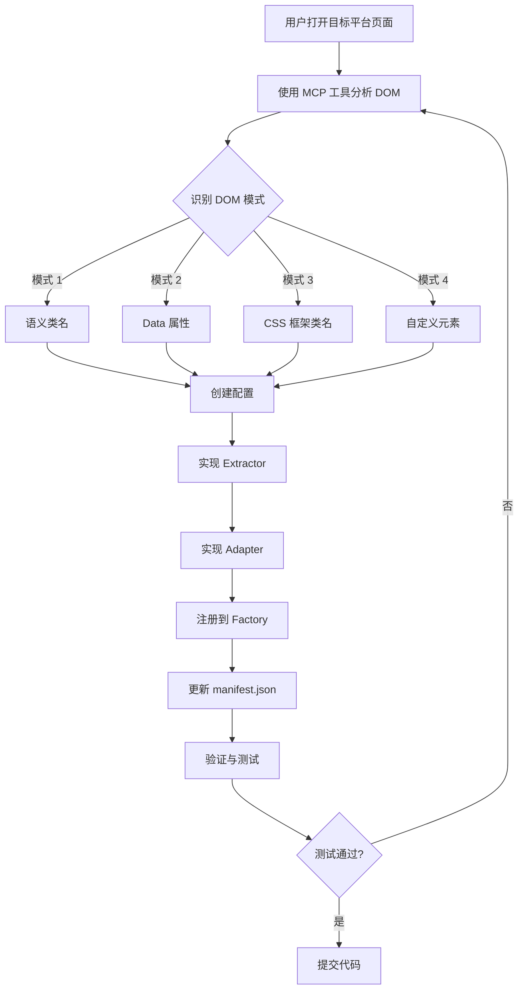

# AI 聊天平台适配完整指南

> 本指南基于 Kimi、豆包、Qwen、Claude、DeepSeek、Gemini 等 8 个平台的实际适配经验总结而成。
>
> **目标读者**: AI Coding Agents（Claude Code、Cursor、GitHub Copilot 等）
>
> **核心原则**: 真实数据驱动 + 模式化开发 + 质量优先

---

## 📋 目录

1. [前置准备：DOM 分析工具与方法](#1-前置准备dom-分析工具与方法)
2. [DOM 特征识别模式](#2-dom-特征识别模式)
3. [实现步骤（7 步法）](#3-实现步骤7-步法)
4. [常见陷阱与解决方案](#4-常见陷阱与解决方案)
5. [质量检查清单](#5-质量检查清单)
6. [参考实现与效率技巧](#6-参考实现与效率技巧)

---

## 1. 前置准备：DOM 分析工具与方法

### 1.1 核心工具：Chrome DevTools MCP

**⚠️ 关键原则**: **绝对不要猜测或假设 DOM 结构，必须使用真实页面数据分析**。

#### 工具 A: `mcp__chrome-devtools__list_pages`

**用途**: 列出浏览器中所有打开的页面

**使用时机**: 开始分析前的第一步

**示例调用**:
```typescript
mcp__chrome-devtools__list_pages()
```

**返回示例**:
```json
[
  {
    "pageIdx": 0,
    "title": "Claude",
    "url": "https://claude.ai/chat/..."
  },
  {
    "pageIdx": 1,
    "title": "Kimi - AI助手",
    "url": "https://www.kimi.com/chat/19a971f9-fc12-83bc-8000-09e651aee0ee"
  },
  {
    "pageIdx": 2,
    "title": "豆包",
    "url": "https://www.doubao.com/chat/29876000872453378"
  }
]
```

**关键信息**:
- `pageIdx`: 后续操作需要的页面索引
- `url`: 确认是否为目标平台

---

#### 工具 B: `mcp__chrome-devtools__select_page`

**用途**: 选择要分析的目标页面

**使用时机**: 在 list_pages 之后，进行任何 DOM 操作之前

**示例调用**:
```typescript
mcp__chrome-devtools__select_page({ pageIdx: 1 })  // 选择 Kimi 页面
```

**重要**: 每次只能有一个页面被选中，后续的 snapshot、evaluate_script 等操作都针对当前选中页面。

---

#### 工具 C: `mcp__chrome-devtools__take_snapshot`

**用途**: 获取页面的文本化 DOM 结构快照（基于 a11y tree）

**使用时机**: 选择页面后，用于快速浏览页面结构

**示例调用**:
```typescript
mcp__chrome-devtools__take_snapshot({ verbose: false })
```

**返回示例**（简化版）:
```
StaticText "Kimi"
  button "新建对话"
  generic
    StaticText "hi"
    StaticText "你是谁？"
    StaticText "继续"
```

**参数说明**:
- `verbose: false` - 简化输出（推荐用于快速扫描）
- `verbose: true` - 完整 a11y 树（用于深入分析）
- `filePath: "snapshot.txt"` - 保存到文件（可选）

**局限性**: snapshot 是文本化的，不包含 CSS 类名、data 属性等，需要配合 evaluate_script 使用。

---

#### 工具 D: `mcp__chrome-devtools__evaluate_script`

**用途**: 在页面中执行 JavaScript 代码，返回结构化数据

**使用时机**: 需要精确提取 DOM 元素的类名、属性、层级关系时

**示例 1: 查找用户消息容器**

```typescript
mcp__chrome-devtools__evaluate_script({
  function: `() => {
    // 查找所有可能的消息容器
    const candidates = [
      ...document.querySelectorAll('[data-message-id]'),
      ...document.querySelectorAll('.message'),
      ...document.querySelectorAll('.segment-user'),
    ];

    return candidates.slice(0, 5).map(el => ({
      tagName: el.tagName,
      className: el.className,
      dataAttrs: Array.from(el.attributes)
        .filter(attr => attr.name.startsWith('data-'))
        .map(attr => ({ name: attr.name, value: attr.value })),
      textPreview: el.innerText.substring(0, 100),
    }));
  }`
})
```

**返回示例**:
```json
[
  {
    "tagName": "DIV",
    "className": "flex justify-end mb-4",
    "dataAttrs": [
      { "name": "data-message-id", "value": "msg_123" }
    ],
    "textPreview": "hi"
  },
  {
    "tagName": "DIV",
    "className": "flex justify-end mb-4",
    "dataAttrs": [
      { "name": "data-message-id", "value": "msg_124" }
    ],
    "textPreview": "你几岁啦？"
  }
]
```

**示例 2: 测试选择器精度**

```typescript
mcp__chrome-devtools__evaluate_script({
  function: `() => {
    // 测试不同选择器的匹配结果
    const selectors = [
      '[data-message-id]',
      '.justify-end',
      '[data-message-id].justify-end',
    ];

    return selectors.map(sel => ({
      selector: sel,
      count: document.querySelectorAll(sel).length,
      firstMatch: document.querySelector(sel)?.innerText.substring(0, 50),
    }));
  }`
})
```

**返回**:
```json
[
  {
    "selector": "[data-message-id]",
    "count": 10,
    "firstMatch": "hi"
  },
  {
    "selector": ".justify-end",
    "count": 5,
    "firstMatch": "hi"
  },
  {
    "selector": "[data-message-id].justify-end",
    "count": 5,
    "firstMatch": "hi"
  }
]
```

**关键技巧**:
- 返回值必须是 JSON 可序列化的（不能返回 DOM 元素本身）
- 使用 `Array.from()` 将 NodeList 转为数组
- 预览文本时用 `substring` 避免返回超大数据

**示例 3: 分析元素层级关系**

```typescript
mcp__chrome-devtools__evaluate_script({
  function: `() => {
    const userMsg = document.querySelector('.segment-user');
    if (!userMsg) return null;

    return {
      self: {
        tag: userMsg.tagName,
        classes: Array.from(userMsg.classList),
      },
      parent: {
        tag: userMsg.parentElement?.tagName,
        classes: Array.from(userMsg.parentElement?.classList || []),
      },
      children: Array.from(userMsg.children).map(child => ({
        tag: child.tagName,
        classes: Array.from(child.classList),
        textLength: child.innerText?.length || 0,
      })),
    };
  }`
})
```

---

### 1.2 辅助工具：Task Agent (Explore 模式)

**用途**: 自动化 DOM 分析，快速获取结构化信息

**使用时机**: 当需要同时分析多个平台或进行复杂的 DOM 遍历时

**示例调用**:

```typescript
Task({
  subagent_type: "Explore",
  description: "分析 Kimi 平台 DOM",
  model: "haiku",  // 使用 haiku 更快
  prompt: `分析当前页面（Kimi）的 DOM 结构，找出：

1. 用户消息容器的选择器（至少提供 3 种候选）
2. 消息文本内容的确切位置
3. 是否有唯一标识（data-* 属性、ID 等）
4. 如何区分用户消息和 AI 回复
5. 提取 3-5 条真实的用户消息内容作为验证

要求：
- 使用 Chrome DevTools MCP 工具实际分析
- 不要猜测，必须基于真实 DOM
- 返回可直接使用的选择器字符串`
})
```

**Explore Agent 会自动执行**:
1. `list_pages` 找到目标页面
2. `select_page` 选择页面
3. `evaluate_script` 多次执行不同的分析脚本
4. 返回结构化的分析结果

**返回示例**:
```markdown
## Kimi 平台 DOM 分析结果

### 1. 用户消息容器选择器
- **推荐**: `.segment-user` (语义化，最精确)
- 候选 2: `[class*="segment"][class*="user"]` (更宽松)
- 候选 3: `.segment-container .segment-user` (带父级)

### 2. 消息文本位置
- 容器: `.segment-user`
- 文本内容: `.segment-content-box` (第一级子元素)
- 纯文本提取: `.segment-content-box` 内的所有文本节点

### 3. 唯一标识
- ❌ 无 data-* 属性
- ❌ 无固定 ID
- ✅ 需要基于内容哈希生成唯一 ID

### 4. 区分用户/AI 消息
- 用户消息: 包含 `.segment-user` 类
- AI 回复: 包含 `.segment-assistant` 类
- 清晰区分，无需额外过滤

### 5. 真实消息样例
1. "hi"
2. "你是谁？"
3. "继续"
4. "帮我写一个冒泡排序"
5. "用 Python 实现"
```

---

### 1.3 浏览器开发工具（手动验证）

虽然 AI Agent 主要使用 MCP 工具，但了解人工验证方法有助于理解分析逻辑。

#### 方法 1: Elements 面板定位元素

1. **右键点击**用户消息 → "检查元素"
2. 观察 DOM 树中的位置和类名
3. **关键观察点**:
   - 父容器的类名或属性
   - 是否有 `data-*` 属性
   - 同级元素是否为 AI 回复
   - CSS 类名是否语义化

**示例（Kimi）**:
```html
<div class="segment-container">
  <!-- 用户消息 -->
  <div class="segment-user">
    <div class="segment-content-box">
      <span>hi</span>
    </div>
  </div>

  <!-- AI 回复 -->
  <div class="segment-assistant">
    <div class="segment-content-box">
      <span>你好！...</span>
    </div>
  </div>
</div>
```

#### 方法 2: Console 面板测试选择器

在 Console 中运行以下代码验证选择器：

```javascript
// 测试选择器是否精确
document.querySelectorAll('.segment-user').length  // 应该等于用户消息数

// 提取所有用户消息
Array.from(document.querySelectorAll('.segment-user'))
  .map(el => el.innerText.trim())

// 检查是否有误匹配
Array.from(document.querySelectorAll('.segment-user'))
  .filter(el => el.querySelector('.segment-assistant'))  // 应该为空数组
```

#### 方法 3: Network 面板（高级）

某些平台可能通过 API 返回消息数据：

1. 打开 Network 面板
2. 过滤 XHR/Fetch 请求
3. 发送一条消息，观察请求
4. 查看 Response 中的 JSON 结构

**用途**:
- 了解消息的服务端数据格式
- 可能发现消息 ID 的生成规则
- 某些平台可以直接从 API 提取（如 ChatGPT）

---

### 1.4 完整 DOM 分析流程（实战）

以 **豆包（Doubao）** 为例，展示完整的分析流程：

#### Step 1: 列出并选择页面

```typescript
// 1. 列出所有页面
const pages = await mcp__chrome-devtools__list_pages();
// 找到 doubao.com 的索引（假设是 pageIdx: 2）

// 2. 选择页面
await mcp__chrome-devtools__select_page({ pageIdx: 2 });
```

#### Step 2: 快速扫描 DOM 结构

```typescript
// 3. 获取页面快照
const snapshot = await mcp__chrome-devtools__take_snapshot({ verbose: false });

// 查看快照，寻找用户消息的文本特征
// 输出中会看到类似 "hi", "你几岁啦" 等用户输入的内容
```

#### Step 3: 定位消息容器

```typescript
// 4. 查找包含用户消息的元素
const analysis = await mcp__chrome-devtools__evaluate_script({
  function: `() => {
    // 假设用户输入了 "hi"，搜索包含这个文本的元素
    const allElements = document.querySelectorAll('*');
    const candidates = Array.from(allElements).filter(el => {
      return el.innerText?.trim() === 'hi' &&
             el.children.length < 5;  // 避免匹配到太大的容器
    });

    return candidates.slice(0, 3).map(el => ({
      tagName: el.tagName,
      className: el.className,
      id: el.id,
      dataAttrs: Object.fromEntries(
        Array.from(el.attributes)
          .filter(attr => attr.name.startsWith('data-'))
          .map(attr => [attr.name, attr.value])
      ),
      path: getPath(el),
    }));

    function getPath(el) {
      const path = [];
      while (el && el !== document.body) {
        let selector = el.tagName.toLowerCase();
        if (el.id) selector += '#' + el.id;
        if (el.className) selector += '.' + el.className.split(' ').join('.');
        path.unshift(selector);
        el = el.parentElement;
      }
      return path.join(' > ');
    }
  }`
});

console.log(analysis);
```

**输出示例**:
```json
[
  {
    "tagName": "DIV",
    "className": "flex justify-end mb-4",
    "id": "",
    "dataAttrs": {
      "data-message-id": "msg_abc123"
    },
    "path": "div.chat-container > div.message-list > div.flex.justify-end.mb-4"
  }
]
```

**关键发现**:
1. ✅ 有 `data-message-id` 属性（可用于唯一标识）
2. ✅ 有 `justify-end` 类（Tailwind CSS，表示右对齐 = 用户消息）
3. ⚠️ 父容器 `.message-list` 可能包含所有消息（用户+AI）

#### Step 4: 验证筛选逻辑

```typescript
// 5. 测试是否所有消息都有 data-message-id
const allMessages = await mcp__chrome-devtools__evaluate_script({
  function: `() => {
    const messages = document.querySelectorAll('[data-message-id]');
    return {
      total: messages.length,
      withJustifyEnd: Array.from(messages).filter(m =>
        m.classList.contains('justify-end') ||
        m.querySelector('.justify-end')
      ).length,
      samples: Array.from(messages).slice(0, 3).map(m => ({
        hasJustifyEnd: m.classList.contains('justify-end'),
        text: m.innerText.substring(0, 50),
      })),
    };
  }`
});

console.log(allMessages);
```

**输出示例**:
```json
{
  "total": 10,
  "withJustifyEnd": 5,
  "samples": [
    { "hasJustifyEnd": true, "text": "hi" },
    { "hasJustifyEnd": false, "text": "你好！我是豆包..." },
    { "hasJustifyEnd": true, "text": "你几岁啦？" }
  ]
}
```

**结论**:
- `[data-message-id]` 匹配所有消息（用户 + AI）
- 需要用 `.justify-end` 筛选出用户消息
- 用户消息数 = `withJustifyEnd` 数量

#### Step 5: 提取真实消息验证

```typescript
// 6. 提取所有用户消息
const userMessages = await mcp__chrome-devtools__evaluate_script({
  function: `() => {
    const allMessages = document.querySelectorAll('[data-message-id]');
    const userMessages = Array.from(allMessages).filter(m =>
      m.classList.contains('justify-end') ||
      m.querySelector('.justify-end')
    );

    return userMessages.map((m, idx) => ({
      index: idx,
      messageId: m.getAttribute('data-message-id'),
      text: m.innerText.trim(),
    }));
  }`
});

console.log(userMessages);
```

**输出示例**:
```json
[
  { "index": 0, "messageId": "msg_001", "text": "hi" },
  { "index": 1, "messageId": "msg_003", "text": "你几岁啦？" },
  { "index": 2, "messageId": "msg_005", "text": "继续" },
  { "index": 3, "messageId": "msg_007", "text": "再说一次" },
  { "index": 4, "messageId": "msg_009", "text": "谢谢" }
]
```

✅ **验证通过**: 成功提取了 5 条真实的用户消息。

#### Step 6: 确定最终选择器配置

基于以上分析，确定配置：

```typescript
export const DOUBAO_CONFIG: PlatformConfig = {
  name: 'Doubao (豆包)',
  type: PlatformType.DOUBAO,
  urlPatterns: ['https://www.doubao.com/*', 'https://doubao.com/*'],
  hostname: 'doubao.com',
  selectors: {
    userMessages: [],  // 不用文本识别
    articleContainer: '[data-message-id]',  // 所有消息
    // ⚠️ 注意：需要在 Extractor 中用 .justify-end 进一步筛选
    ignoredTags: ['BUTTON', 'SVG', 'SCRIPT', 'STYLE', 'NOSCRIPT'],
  },
  // ...
};
```

---

### 1.5 DOM 分析最佳实践

#### ✅ 应该做的事

1. **总是使用真实页面数据**
   ```typescript
   // ✅ 正确
   const result = await mcp__chrome-devtools__evaluate_script({ ... });

   // ❌ 错误
   // "我猜测豆包应该用 .user-message 选择器"
   ```

2. **提取 3-5 条真实消息验证**
   - 确保选择器精确
   - 验证没有误匹配 AI 回复
   - 检查消息完整性（没有截断）

3. **测试多种选择器候选**
   ```typescript
   const candidates = [
     '[data-message-id].justify-end',
     '.user-message',
     '.segment-user',
   ];
   // 测试每个候选的匹配数量和准确性
   ```

4. **记录分析过程**
   - 将 `evaluate_script` 的结果保存为日志
   - 便于后续调试和优化

#### ❌ 不应该做的事

1. **不要根据其他平台推测**
   ```typescript
   // ❌ 错误思路
   // "Claude 用 data-testid，所以豆包可能也用 data-testid"
   ```

2. **不要只测试一条消息**
   - 至少提取 3-5 条消息
   - 验证选择器的稳定性

3. **不要忽略边界情况**
   - 空消息如何处理？
   - 包含代码块的消息能否正确提取？
   - 多行消息是否完整？

4. **不要跳过 Console 验证**
   - 即使 MCP 工具返回结果，也应在浏览器 Console 手动验证一次

---

## 2. DOM 特征识别模式

### 2.1 四种用户消息识别模式

根据 8 个平台的实际经验，用户消息识别可归纳为 4 种模式：

#### 模式 1: 语义化类名（最简单）

**特征**: 平台使用有意义的 CSS 类名区分用户和 AI 消息

**优点**:
- 选择器简洁
- 代码可读性高
- 不需要额外过滤逻辑

**示例平台**: Kimi, Qwen Intl

**Kimi 示例**:
```html
<!-- 用户消息 -->
<div class="segment-user">
  <div class="segment-content-box">hi</div>
</div>

<!-- AI 回复 -->
<div class="segment-assistant">
  <div class="segment-content-box">你好！...</div>
</div>
```

**配置**:
```typescript
selectors: {
  userMessages: [],
  articleContainer: '.segment-user',  // ✅ 直接精确匹配
}
```

**Extractor 实现**:
```typescript
// 非常简单，无需 filter
private findUserMessages(): HTMLElement[] {
  return Array.from(
    document.querySelectorAll<HTMLElement>(
      this.config.selectors.articleContainer
    )
  );
}
```

---

#### 模式 2: Data 属性（最可靠）

**特征**: 使用 `data-*` 属性标识消息，通常配合其他属性或类名区分

**优点**:
- 唯一标识，便于去重
- 不受 CSS 框架变化影响
- 适合用于消息追踪

**示例平台**: Claude, DeepSeek, Doubao

**Claude 示例**:
```html
<div data-testid="user-message">
  <p>用户的问题...</p>
</div>
```

**配置**:
```typescript
selectors: {
  userMessages: [],
  articleContainer: '[data-testid="user-message"]',  // ✅ data 属性精确匹配
}
```

**DeepSeek 示例**:
```html
<div data-um-id="um_12345" class="user-message-wrapper">
  <div class="fbb737a4">用户消息文本</div>
</div>
```

**配置**:
```typescript
selectors: {
  userMessages: [],
  articleContainer: '[data-um-id]',  // ✅ 所有用户消息都有此属性
  userMessageText: '.fbb737a4',      // 文本容器
}
```

---

#### 模式 3: CSS 框架类名（需要筛选）

**特征**: 使用 CSS 框架（如 Tailwind）的工具类，需要额外逻辑筛选

**缺点**:
- 选择器不够精确
- 需要在 Extractor 中添加 filter 逻辑
- 代码复杂度增加

**示例平台**: Doubao

**Doubao 示例**:
```html
<!-- 用户消息（右对齐） -->
<div data-message-id="msg_001" class="flex justify-end mb-4">
  <div class="bubble">hi</div>
</div>

<!-- AI 回复（左对齐） -->
<div data-message-id="msg_002" class="flex justify-start mb-4">
  <div class="bubble">你好...</div>
</div>
```

**配置**:
```typescript
selectors: {
  userMessages: [],
  articleContainer: '[data-message-id]',  // ⚠️ 匹配所有消息（用户+AI）
  // 需要在 Extractor 中用 .justify-end 筛选
}
```

**Extractor 实现**:
```typescript
// ⚠️ 需要额外的 filter 逻辑
private findAllMessages(): HTMLElement[] {
  return Array.from(
    document.querySelectorAll<HTMLElement>(
      this.config.selectors.articleContainer
    )
  );
}

private filterUserMessages(messages: HTMLElement[]): HTMLElement[] {
  return messages.filter(msg =>
    msg.classList.contains('justify-end') ||
    msg.querySelector('.justify-end') !== null
  );
}

async extract(): Promise<Prompt[]> {
  const allMessages = this.findAllMessages();
  const userMessages = this.filterUserMessages(allMessages);  // ✅ 筛选
  // ...
}
```

---

#### 模式 4: 自定义元素（框架特定）

**特征**: 使用 Web Components 或框架自定义元素

**优点**: 语义清晰

**缺点**: 需要了解框架特性

**示例平台**: Gemini (Angular)

**Gemini 示例**:
```html
<user-query>
  <div class="horizontal-container">
    <span>用户的问题...</span>
  </div>
</user-query>
```

**配置**:
```typescript
selectors: {
  userMessages: [],
  userQueryElement: 'user-query',  // ✅ 自定义元素
  userQueryText: '.horizontal-container',
}
```

**Extractor 实现**:
```typescript
private findUserQueries(): HTMLElement[] {
  const { userQueryElement } = this.config.selectors;
  return Array.from(
    document.querySelectorAll<HTMLElement>(userQueryElement!)
  );
}
```

---

### 2.2 关键验证问题清单

在分析 DOM 时，必须回答以下 5 个问题：

#### Q1: 如何找到所有消息容器？

**目标**: 确定 `articleContainer` 选择器

**验证方法**:
```typescript
const count = document.querySelectorAll('.your-selector').length;
// 应该等于页面上可见的消息总数（用户 + AI）
```

**常见选择器模式**:
- `.message`
- `[data-message-id]`
- `.segment-container`
- `article`

#### Q2: 如何从所有消息中筛选出用户消息？

**目标**: 确定是否需要额外的 filter 逻辑

**验证方法**:
```typescript
// 测试选择器是否只匹配用户消息
const userOnly = document.querySelectorAll('.user-message');
const all = document.querySelectorAll('.message');
console.log(`用户消息: ${userOnly.length}, 总消息: ${all.length}`);
// 如果 userOnly.length < all.length，说明选择器已经精确
// 如果 userOnly.length === all.length，说明需要额外筛选
```

**筛选方法**:
1. 类名筛选: `.filter(m => m.classList.contains('user'))`
2. 属性筛选: `.filter(m => m.getAttribute('data-sender') === 'user')`
3. 结构筛选: `.filter(m => m.querySelector('.user-avatar'))`

#### Q3: 消息文本在哪里？

**目标**: 确定 `userBubble` 或 `textContainer` 选择器

**验证方法**:
```typescript
const container = document.querySelector('.user-message');
const textEl = container.querySelector('.text-content');
console.log(textEl?.innerText);  // 应该只包含消息文本，不含按钮等
```

**提取策略**:
1. 如果文本直接在容器内: `container.innerText`
2. 如果文本在子元素内: `container.querySelector('.text').innerText`
3. 如果需要过滤元素: 使用 `BaseExtractor.extractText()` 方法

#### Q4: 有唯一 ID 吗？

**目标**: 确定如何生成 Prompt 的 `id` 字段

**验证方法**:
```typescript
const msg = document.querySelector('.user-message');
console.log({
  id: msg.id,
  dataId: msg.getAttribute('data-message-id'),
  dataUmId: msg.getAttribute('data-um-id'),
});
```

**处理策略**:
- ✅ 有唯一 ID: 直接使用
  ```typescript
  const id = msgElement.getAttribute('data-message-id');
  ```
- ❌ 无唯一 ID: 基于内容哈希生成
  ```typescript
  const id = this.generateIdFromContent(content);
  ```

#### Q5: 对话 ID 在 URL 的哪里？

**目标**: 确定 `getCurrentConversationId()` 的正则表达式

**验证方法**:
```typescript
const url = window.location.href;
// 示例 URL:
// Kimi: https://www.kimi.com/chat/19a971f9-fc12-83bc-8000-09e651aee0ee
// Doubao: https://www.doubao.com/chat/29876000872453378
// Claude: https://claude.ai/chat/abc-def-123

// 提取对话 ID
const match = url.match(/\/chat\/([^\/\?]+)/);
console.log(match?.[1]);
```

**常见模式**:
```typescript
// UUID 格式（Kimi, Claude）
/\/chat\/([a-f0-9-]+)/

// 数字 ID（Doubao）
/\/chat\/(\d+)/

// Base64 或字母数字（通用）
/\/chat\/([a-zA-Z0-9_-]+)/
```

---

### 2.3 实战案例对比

下表对比 3 个典型平台的 DOM 特征：

| 特征 | Kimi（语义类名） | Doubao（CSS 框架） | Claude（Data 属性） |
|------|-----------------|-------------------|-------------------|
| **消息容器** | `.segment-user` | `[data-message-id]` | `[data-testid="user-message"]` |
| **是否需要筛选** | ❌ 否 | ✅ 是（`.justify-end`） | ❌ 否 |
| **文本位置** | `.segment-content-box` | 直接在容器内 | `p` 标签 |
| **唯一 ID** | ❌ 无（需生成） | ✅ `data-message-id` | ✅ 自动生成 |
| **对话 ID 格式** | UUID | 数字 | 字母数字 |
| **难度** | ⭐⭐ 简单 | ⭐⭐⭐ 中等 | ⭐⭐ 简单 |

**学习建议**:
- 新手先参考 **Kimi** 或 **Claude**（简单直接）
- 有经验后参考 **Doubao**（理解筛选逻辑）

---

## 3. 实现步骤（7 步法）

### Step 1: 更新类型定义

**文件**: `src/types/Platform.ts`

**操作**: 在 `PlatformType` 枚举中添加新平台

```typescript
export enum PlatformType {
  CHATGPT = 'chatgpt',
  GEMINI = 'gemini',
  CLAUDE = 'claude',
  DEEPSEEK = 'deepseek',
  QWEN_CN = 'qwen-cn',
  QWEN_INTL = 'qwen-intl',
  KIMI = 'kimi',
  DOUBAO = 'doubao',
  NEW_PLATFORM = 'new-platform',  // ← 新增
  UNKNOWN = 'unknown',
}
```

**验证**: 运行 `bun run check:types` 确保没有类型错误

---

### Step 2: 添加平台配置

**文件**: `src/config/platforms.ts`

#### 2.1 创建平台配置常量

```typescript
/**
 * 新平台配置
 * 基于 DOM 结构深度分析完成
 */
export const NEW_PLATFORM_CONFIG: PlatformConfig = {
  name: 'Platform Name',  // 显示名称
  type: PlatformType.NEW_PLATFORM,
  urlPatterns: [
    'https://platform.com/*',
    'https://www.platform.com/*',
  ],
  hostname: 'platform.com',  // 主域名
  selectors: {
    userMessages: [],  // ⚠️ 如果不用文本识别则为空数组
    articleContainer: '.user-message',  // ⚠️ 关键选择器
    userBubble: '.message-content',     // 可选：文本容器
    textContainer: '.text-box',         // 可选：更深层的文本容器
    ignoredTags: [
      'BUTTON',
      'SVG',
      'SCRIPT',
      'STYLE',
      'NOSCRIPT',
    ],
    // 可选：特定平台的选择器
    // userMessageText: '.specific-text-class',
    // ignoredClasses: ['action-buttons'],
  },
  ui: {
    primaryColor: '#XXXXXX',  // ⚠️ 品牌主色（从 Logo 提取）
    activeColor: '#XXXXXX',   // 激活色（通常深 10-20%）
    supportsDarkMode: true,   // 是否支持暗色模式
    sidebarPosition: 'right', // 固定为 right
  },
};
```

**品牌色提取方法**:
```typescript
// 在浏览器 Console 中运行：
const logo = document.querySelector('.logo') || document.querySelector('nav');
const color = window.getComputedStyle(logo).backgroundColor;
console.log(color);  // 例如: rgb(114, 46, 209)

// 转换为 hex:
function rgbToHex(rgb) {
  const match = rgb.match(/\d+/g);
  return '#' + match.map(x => parseInt(x).toString(16).padStart(2, '0')).join('');
}
```

#### 2.2 添加到映射

```typescript
export const PLATFORM_CONFIGS: Record<PlatformType, PlatformConfig | null> = {
  [PlatformType.CHATGPT]: CHATGPT_CONFIG,
  [PlatformType.GEMINI]: GEMINI_CONFIG,
  [PlatformType.CLAUDE]: CLAUDE_CONFIG,
  [PlatformType.DEEPSEEK]: DEEPSEEK_CONFIG,
  [PlatformType.QWEN_CN]: QWEN_CN_CONFIG,
  [PlatformType.QWEN_INTL]: QWEN_INTL_CONFIG,
  [PlatformType.KIMI]: KIMI_CONFIG,
  [PlatformType.DOUBAO]: DOUBAO_CONFIG,
  [PlatformType.NEW_PLATFORM]: NEW_PLATFORM_CONFIG,  // ← 新增
  [PlatformType.UNKNOWN]: null,
};
```

#### 2.3 添加检测特征

```typescript
export const PLATFORM_FEATURES = {
  // ... 现有配置
  [PlatformType.NEW_PLATFORM]: {
    urlPattern: /platform\.com/i,  // ⚠️ URL 正则
    domFeatures: [
      '.user-message',
      '.platform-specific-element',
    ],
    windowFeatures: [],  // 通常为空
  },
} as const;
```

---

### Step 3: 实现 Extractor

**文件**: `src/platforms/new-platform/NewPlatformExtractor.ts`

#### 3.1 基础结构（适用于模式 1 & 2）

```typescript
/**
 * 新平台 Prompt 提取器
 * 从新平台页面的 DOM 中提取用户的 Prompts
 */

import { BaseExtractor } from '@/core/extractor/BaseExtractor';
import { Prompt, PromptSource } from '@/types/Prompt';
import { NEW_PLATFORM_CONFIG } from '@/config/platforms';
import { Logger } from '@/utils/logger';

export class NewPlatformExtractor extends BaseExtractor {
  constructor() {
    super(NEW_PLATFORM_CONFIG);
  }

  /**
   * 提取 Prompts
   */
  async extract(): Promise<Prompt[]> {
    try {
      Logger.info('NewPlatformExtractor', 'Starting extraction');

      const userMessages = this.findUserMessages();
      Logger.debug('NewPlatformExtractor', `Found ${userMessages.length} user messages`);

      const prompts: Prompt[] = [];

      for (const msgElement of userMessages) {
        const prompt = this.extractFromMessage(msgElement);
        if (prompt) {
          prompts.push(prompt);
          this.cachePrompt(prompt);
        }
      }

      Logger.info('NewPlatformExtractor', `Extracted ${prompts.length} prompts`);
      return this.sortByTimestamp(prompts);
    } catch (error) {
      this.logError('Extraction failed', error as Error);
      return [];
    }
  }

  /**
   * 查找所有用户消息
   * ⚠️ 如果选择器已经精确（模式 1 & 2），直接返回
   */
  private findUserMessages(): HTMLElement[] {
    const messages = document.querySelectorAll<HTMLElement>(
      this.config.selectors.articleContainer
    );
    return Array.from(messages);
  }

  /**
   * 从用户消息元素提取内容
   */
  private extractFromMessage(msgElement: HTMLElement): Prompt | null {
    const { userBubble } = this.config.selectors;

    // 如果有 userBubble 配置，先定位到文本容器
    let textElement: Element | null = msgElement;
    if (userBubble) {
      textElement = msgElement.querySelector(userBubble);
      if (!textElement) {
        Logger.warn('NewPlatformExtractor', 'Text element not found');
        return null;
      }
    }

    // 提取文本（自动过滤 ignoredTags）
    const content = this.extractText(textElement);

    // 验证内容
    if (!this.isValidContent(content)) {
      return null;
    }

    // 检查是否重复
    if (this.isDuplicate(content)) {
      return null;
    }

    // 平台通常不提供时间戳，使用当前时间
    const timestamp = Date.now();

    // 创建 Prompt 对象
    return this.createPrompt(
      content,
      textElement as HTMLElement,
      PromptSource.DOM,
      timestamp
    );
  }

  /**
   * 增量提取（只提取新的消息）
   */
  async extractNew(): Promise<Prompt[]> {
    const userMessages = this.findUserMessages();
    const newPrompts: Prompt[] = [];

    for (const msgElement of userMessages) {
      const { userBubble } = this.config.selectors;

      let textElement: Element | null = msgElement;
      if (userBubble) {
        textElement = msgElement.querySelector(userBubble);
        if (!textElement) continue;
      }

      const content = this.extractText(textElement);
      if (!this.isValidContent(content) || this.isDuplicate(content)) {
        continue;
      }

      const timestamp = Date.now();
      const prompt = this.createPrompt(
        content,
        textElement as HTMLElement,
        PromptSource.DOM,
        timestamp
      );

      newPrompts.push(prompt);
      this.cachePrompt(prompt);
    }

    Logger.info('NewPlatformExtractor', `Extracted ${newPrompts.length} new prompts`);
    return newPrompts;
  }

  /**
   * 快速检查是否有新消息（用于性能优化）
   */
  hasNewMessages(): boolean {
    const userMessages = this.findUserMessages();
    const currentCount = userMessages.length;
    const cachedCount = this.getCachedPrompts().length;

    return currentCount > cachedCount;
  }
}
```

#### 3.2 带筛选逻辑的版本（适用于模式 3）

如果 `articleContainer` 匹配所有消息（用户 + AI），需要添加筛选：

```typescript
export class NewPlatformExtractor extends BaseExtractor {
  // ... constructor 和其他方法同上

  async extract(): Promise<Prompt[]> {
    try {
      Logger.info('NewPlatformExtractor', 'Starting extraction');

      // ⚠️ 第一步：找到所有消息
      const allMessages = this.findAllMessages();
      Logger.debug('NewPlatformExtractor', `Found ${allMessages.length} total messages`);

      // ⚠️ 第二步：筛选出用户消息
      const userMessages = this.filterUserMessages(allMessages);
      Logger.debug('NewPlatformExtractor', `Found ${userMessages.length} user messages`);

      const prompts: Prompt[] = [];

      for (const msgElement of userMessages) {
        const prompt = this.extractFromMessage(msgElement);
        if (prompt) {
          prompts.push(prompt);
          this.cachePrompt(prompt);
        }
      }

      Logger.info('NewPlatformExtractor', `Extracted ${prompts.length} prompts`);
      return this.sortByTimestamp(prompts);
    } catch (error) {
      this.logError('Extraction failed', error as Error);
      return [];
    }
  }

  /**
   * 查找所有消息容器（用户 + AI）
   */
  private findAllMessages(): HTMLElement[] {
    const messages = document.querySelectorAll<HTMLElement>(
      this.config.selectors.articleContainer
    );
    return Array.from(messages);
  }

  /**
   * 筛选出用户消息
   * ⚠️ 根据平台特征自定义筛选逻辑
   */
  private filterUserMessages(messages: HTMLElement[]): HTMLElement[] {
    // 示例 1: 通过类名筛选（Doubao）
    return messages.filter(msg =>
      msg.classList.contains('justify-end') ||
      msg.querySelector('.justify-end') !== null
    );

    // 示例 2: 通过属性筛选
    // return messages.filter(msg =>
    //   msg.getAttribute('data-sender') === 'user'
    // );

    // 示例 3: 通过结构筛选
    // return messages.filter(msg =>
    //   msg.querySelector('.user-avatar') !== null
    // );
  }

  // ... 其他方法保持不变
}
```

---

### Step 4: 实现 Adapter

**文件**: `src/platforms/new-platform/NewPlatformAdapter.ts`

**重点**: Adapter 的代码 95% 是模板化的，只需修改类名和检测逻辑。

```typescript
/**
 * 新平台适配器
 * 实现新平台特定的功能和逻辑
 */

import { PlatformAdapter } from '@/platforms/base/PlatformAdapter';
import { NewPlatformExtractor } from './NewPlatformExtractor';
import { PlatformType, PlatformConfig } from '@/types/Platform';
import { Prompt } from '@/types/Prompt';
import { NEW_PLATFORM_CONFIG } from '@/config/platforms';
import { Logger } from '@/utils/logger';

export class NewPlatformAdapter extends PlatformAdapter {
  readonly name = 'Platform Name';  // ⚠️ 显示名称
  readonly type = PlatformType.NEW_PLATFORM;  // ⚠️ 平台类型
  readonly version = '1.0.0';

  /** DOM 提取器 */
  private extractor: NewPlatformExtractor;
  /** URL 检查定时器 */
  private urlCheckInterval: ReturnType<typeof setInterval> | null = null;
  /** 最后的 URL */
  private lastUrl = '';

  constructor() {
    super();
    this.extractor = new NewPlatformExtractor();  // ⚠️ 使用对应的 Extractor
  }

  /**
   * 检测是否为该平台页面
   * ⚠️ 根据平台 URL 修改
   */
  detect(): boolean {
    return window.location.href.includes('platform.com');

    // 或者更严格的检测：
    // return (
    //   window.location.href.includes('platform.com') ||
    //   window.location.href.includes('www.platform.com')
    // );
  }

  /**
   * 获取平台配置
   */
  getConfig(): PlatformConfig {
    return NEW_PLATFORM_CONFIG;  // ⚠️ 返回对应的 CONFIG
  }

  /**
   * 提取 Prompts
   */
  async extractPrompts(): Promise<Prompt[]> {
    this.ensureInitialized();
    return this.extractor.extract();
  }

  /**
   * 初始化钩子
   */
  protected override onInitialize(): void {
    Logger.info('NewPlatformAdapter', 'Initializing adapter');

    // 记录当前 URL
    this.lastUrl = window.location.href;

    // 启动 URL 检查（用于检测对话切换）
    this.startURLCheck();

    Logger.info('NewPlatformAdapter', 'Adapter initialized successfully');
  }

  /**
   * 清理钩子
   */
  protected override onDestroy(): void {
    Logger.info('NewPlatformAdapter', 'Destroying adapter');

    // 停止 URL 检查
    this.stopURLCheck();

    // 清理提取器缓存
    this.extractor.clearCache();
  }

  /**
   * 启动 URL 检查
   * 用于检测用户切换对话
   */
  private startURLCheck(): void {
    if (this.urlCheckInterval) {
      return;
    }

    const interval = 500; // 500ms 检查一次

    this.urlCheckInterval = setInterval(() => {
      const currentUrl = window.location.href;

      if (currentUrl !== this.lastUrl) {
        Logger.info('NewPlatformAdapter', 'URL changed, conversation switched');
        this.lastUrl = currentUrl;

        // 清空缓存（新对话）
        this.extractor.clearCache();
      }
    }, interval);

    this.addCleanupTask(() => this.stopURLCheck());

    Logger.debug('NewPlatformAdapter', 'Started URL check');
  }

  /**
   * 停止 URL 检查
   */
  private stopURLCheck(): void {
    if (this.urlCheckInterval) {
      clearInterval(this.urlCheckInterval);
      this.urlCheckInterval = null;
      Logger.debug('NewPlatformAdapter', 'Stopped URL check');
    }
  }

  /**
   * 检查是否有新消息
   */
  hasNewMessages(): boolean {
    return this.extractor.hasNewMessages();
  }

  /**
   * 增量提取新消息
   */
  async extractNewMessages(): Promise<Prompt[]> {
    this.ensureInitialized();
    return this.extractor.extractNew();
  }

  /**
   * 获取当前对话 ID
   * ⚠️ 根据平台 URL 格式修改正则表达式
   */
  getCurrentConversationId(): string | null {
    try {
      // 示例格式：https://platform.com/chat/abc123
      const match = window.location.pathname.match(/\/chat\/([a-zA-Z0-9_-]+)/);
      return match ? match[1] : null;

      // 常见正则模式：
      // UUID: /\/chat\/([a-f0-9-]+)/
      // 数字: /\/chat\/(\d+)/
      // Base64: /\/chat\/([a-zA-Z0-9_-]+)/
    } catch (error) {
      Logger.error('NewPlatformAdapter', 'Failed to get conversation ID', error as Error);
      return null;
    }
  }

  /**
   * 检查是否在对话页面
   */
  isInConversation(): boolean {
    return this.getCurrentConversationId() !== null;
  }

  /**
   * 等待对话加载完成
   */
  async waitForConversationLoad(timeout = 10000): Promise<boolean> {
    try {
      await this.waitForElement('.user-message', timeout);  // ⚠️ 使用 articleContainer 选择器
      Logger.info('NewPlatformAdapter', 'Conversation loaded');
      return true;
    } catch (error) {
      Logger.error('NewPlatformAdapter', 'Conversation load timeout', error as Error);
      return false;
    }
  }
}
```

---

### Step 5: 注册到 Factory

**文件**: `src/platforms/factory.ts`

在 `create()` 方法的 `switch` 语句中添加新 case：

```typescript
switch (detectedType) {
  case PlatformType.CHATGPT:
    const { ChatGPTAdapter } = await import('./chatgpt/ChatGPTAdapter');
    adapter = new ChatGPTAdapter();
    break;

  case PlatformType.GEMINI:
    const { GeminiAdapter } = await import('./gemini/GeminiAdapter');
    adapter = new GeminiAdapter();
    break;

  // ... 其他 cases

  case PlatformType.NEW_PLATFORM:  // ← 新增
    const { NewPlatformAdapter } = await import('./new-platform/NewPlatformAdapter');
    adapter = new NewPlatformAdapter();
    break;

  case PlatformType.UNKNOWN:
  default:
    throw new Error(`Unsupported platform: ${detectedType}`);
}
```

**注意**: 使用动态导入（`await import`）以减小初始包体积。

---

### Step 6: 更新 manifest.json

**文件**: `public/manifest.json`

#### 6.1 更新描述

```json
{
  "description": "Track and manage your AI chat prompts across multiple platforms (ChatGPT, Gemini, Claude, DeepSeek, Qwen, Kimi, Doubao, NewPlatform)"
}
```

#### 6.2 添加 host_permissions

```json
{
  "host_permissions": [
    "https://chatgpt.com/*",
    "https://chat.openai.com/*",
    "https://gemini.google.com/*",
    "https://claude.ai/*",
    "https://chat.deepseek.com/*",
    "https://www.tongyi.com/*",
    "https://tongyi.com/*",
    "https://chat.qwen.ai/*",
    "https://www.kimi.com/*",
    "https://kimi.com/*",
    "https://kimi.moonshot.cn/*",
    "https://www.doubao.com/*",
    "https://doubao.com/*",
    "https://platform.com/*",         // ← 新增
    "https://www.platform.com/*"      // ← 新增（如果需要）
  ]
}
```

**提示**: 始终包含带 `www` 和不带 `www` 的域名变体。

#### 6.3 添加 content_scripts

```json
{
  "content_scripts": [
    {
      "matches": [
        "https://chatgpt.com/*",
        "https://chat.openai.com/*",
        "https://gemini.google.com/*",
        "https://claude.ai/*",
        "https://chat.deepseek.com/*",
        "https://www.tongyi.com/*",
        "https://tongyi.com/*",
        "https://chat.qwen.ai/*",
        "https://www.kimi.com/*",
        "https://kimi.com/*",
        "https://kimi.moonshot.cn/*",
        "https://www.doubao.com/*",
        "https://doubao.com/*",
        "https://platform.com/*",      // ← 新增
        "https://www.platform.com/*"   // ← 新增
      ],
      "js": ["content.js"],
      "run_at": "document_end"
    }
  ]
}
```

---

### Step 7: 验证与提交

#### 7.1 类型检查

```bash
bun run check:types
```

**期望输出**: 无错误

**常见错误**:
- `Property 'NEW_PLATFORM' does not exist on type 'PlatformType'`
  - 解决: 确保在 `Platform.ts` 中添加了枚举值
- `Type 'NewPlatformConfig' is not assignable to type 'PlatformConfig'`
  - 解决: 检查配置对象的属性是否完整

#### 7.2 构建

```bash
bun run build
```

**期望输出**:
```
✓ svelte-check found 0 errors and 0 warnings
✓ tsgo found 0 errors
✓ built in XXXms
dist/content.js  XX.XX kB │ gzip: XX.XX kB
```

**常见错误**:
- `Module not found: Can't resolve './new-platform/NewPlatformAdapter'`
  - 解决: 检查文件路径和导入语句

#### 7.3 手动测试

1. **加载扩展**:
   - Chrome/Edge → `chrome://extensions/`
   - 启用"开发者模式"
   - 点击"加载已解压的扩展程序"
   - 选择 `dist` 目录

2. **访问目标平台**:
   - 打开 `https://platform.com/chat/xxx`
   - 打开浏览器 Console
   - 查看是否有初始化日志：
     ```
     [NewPlatformAdapter] Initializing adapter
     [NewPlatformExtractor] Starting extraction
     [NewPlatformExtractor] Found X user messages
     [NewPlatformExtractor] Extracted X prompts
     ```

3. **验证提取结果**:
   - 在 Console 中运行：
     ```javascript
     window.__promptHistoryApp.store.getPrompts()
     ```
   - 检查返回的 Prompt 数组是否正确

#### 7.4 提交代码

```bash
# 添加文件
git add src/platforms/new-platform/ \
        src/types/Platform.ts \
        src/config/platforms.ts \
        src/platforms/factory.ts \
        public/manifest.json

# 提交（使用 heredoc 确保格式）
git commit -m "$(cat <<'EOF'
feat: 添加 NewPlatform 平台支持

- 新增 NewPlatformExtractor 和 NewPlatformAdapter
- 支持 platform.com 域名
- 使用 .user-message 选择器识别用户消息
- 对话 ID 格式：/chat/[id]
- 品牌色：#XXXXXX

✓ TypeScript 类型检查通过
✓ Svelte 组件检查通过（0 errors, 0 warnings）
✓ 生产构建成功
EOF
)"
```

---

## 4. 常见陷阱与解决方案

### 陷阱 1: 猜测 DOM 结构

❌ **错误做法**:
```typescript
// "我觉得新平台应该和 ChatGPT 类似，用 .user-message"
selectors: {
  articleContainer: '.user-message',
}
```

✅ **正确做法**:
```typescript
// 1. 使用 Chrome DevTools MCP 分析真实页面
const result = await mcp__chrome-devtools__evaluate_script({
  function: `() => {
    const messages = document.querySelectorAll('.user-message');
    return messages.length;
  }`
});

// 2. 验证选择器准确性
// 3. 提取 3-5 条真实消息
```

**教训**: 每个平台的 DOM 结构都是独特的，绝对不要假设。

---

### 陷阱 2: 遗漏 filter 逻辑

❌ **错误做法**:
```typescript
// Doubao 的 [data-message-id] 会匹配所有消息（用户 + AI）
selectors: {
  articleContainer: '[data-message-id]',
}

// 直接使用，导致提取到 AI 回复
private findUserMessages(): HTMLElement[] {
  return Array.from(
    document.querySelectorAll(this.config.selectors.articleContainer)
  );
}
```

✅ **正确做法**:
```typescript
// 添加筛选逻辑
private findAllMessages(): HTMLElement[] {
  return Array.from(
    document.querySelectorAll(this.config.selectors.articleContainer)
  );
}

private filterUserMessages(messages: HTMLElement[]): HTMLElement[] {
  return messages.filter(msg =>
    msg.classList.contains('justify-end') ||
    msg.querySelector('.justify-end') !== null
  );
}
```

**教训**: 分析时必须验证选择器是否只匹配用户消息。

---

### 陷阱 3: ignoredTags 不完整

❌ **错误做法**:
```typescript
ignoredTags: ['BUTTON', 'SVG'],  // 遗漏了 SCRIPT, STYLE
```

**后果**: 提取的文本包含脚本或样式内容。

✅ **正确做法**:
```typescript
ignoredTags: [
  'BUTTON',
  'SVG',
  'SCRIPT',
  'STYLE',
  'NOSCRIPT',
],
```

**提示**: 如果是 Angular/Material 平台，还要加：
```typescript
'MAT-ICON',
'TTS-CONTROL',
'MESSAGE-ACTIONS',
```

---

### 陷阱 4: 忘记 cleanup URL 监听

❌ **错误做法**:
```typescript
private startURLCheck(): void {
  this.urlCheckInterval = setInterval(() => {
    // ...
  }, 500);
  // ❌ 忘记注册 cleanup
}
```

**后果**: 内存泄漏，定时器在 adapter destroy 后仍运行。

✅ **正确做法**:
```typescript
private startURLCheck(): void {
  this.urlCheckInterval = setInterval(() => {
    // ...
  }, 500);

  this.addCleanupTask(() => this.stopURLCheck());  // ✅ 注册 cleanup
}
```

---

### 陷阱 5: 对话 ID 正则不准确

❌ **错误做法**:
```typescript
// 假设所有平台都用 UUID
const match = window.location.pathname.match(/\/chat\/([a-f0-9-]+)/);
```

**后果**: Doubao（数字 ID）提取失败。

✅ **正确做法**:
```typescript
// 根据平台实际 URL 调整正则

// Kimi (UUID): https://www.kimi.com/chat/19a971f9-fc12-83bc-8000-09e651aee0ee
const match = window.location.pathname.match(/\/chat\/([a-f0-9-]+)/);

// Doubao (数字): https://www.doubao.com/chat/29876000872453378
const match = window.location.pathname.match(/\/chat\/(\d+)/);

// 通用 (字母数字): https://platform.com/chat/abc123DEF
const match = window.location.pathname.match(/\/chat\/([a-zA-Z0-9_-]+)/);
```

**教训**: 在浏览器地址栏观察真实的 URL 格式。

---

### 陷阱 6: 只测试一条消息

❌ **错误做法**:
```typescript
// 只提取第一条消息验证
const firstMessage = document.querySelector('.user-message')?.innerText;
console.log(firstMessage);  // "hi"
// ✅ 看起来没问题！
```

**隐患**: 第二条消息可能有特殊格式（代码块、图片等），选择器失效。

✅ **正确做法**:
```typescript
// 提取至少 3-5 条消息
const allMessages = Array.from(document.querySelectorAll('.user-message'))
  .map(el => el.innerText);
console.log(allMessages);
// ["hi", "你好\n这是第二行", "```\ncode block\n```", "带图片的消息"]

// 验证所有消息都能正确提取
```

---

## 5. 质量检查清单

提交前必须完成以下检查：

### 代码质量

- [ ] **使用真实页面的 DOM 分析**（不是猜测）
- [ ] **提取了 3-5 条真实消息验证**（在日志中可见）
- [ ] **TypeScript 类型检查通过** (`bun run check:types`)
- [ ] **Svelte 组件检查通过** (`bun run check:svelte`)
- [ ] **生产构建成功** (`bun run build`)

### Extractor 实现

- [ ] **实现了 `extract()` 方法**
- [ ] **实现了 `extractNew()` 方法**
- [ ] **实现了 `hasNewMessages()` 方法**
- [ ] **如果需要 filter 逻辑，已正确实现**
- [ ] **ignoredTags 配置完整**

### Adapter 实现

- [ ] **实现了 `detect()` 方法**（URL 检测）
- [ ] **实现了 URL 监听**（`startURLCheck`）
- [ ] **注册了 cleanup 任务**（`addCleanupTask`）
- [ ] **实现了 `getCurrentConversationId()`**（正则正确）
- [ ] **实现了 `waitForConversationLoad()`**

### 配置与注册

- [ ] **在 `Platform.ts` 中添加了枚举值**
- [ ] **在 `platforms.ts` 中创建了 CONFIG 常量**
- [ ] **在 `PLATFORM_CONFIGS` 映射中注册**
- [ ] **在 `PLATFORM_FEATURES` 中添加了检测特征**
- [ ] **在 `factory.ts` 中添加了 case 分支**
- [ ] **在 `manifest.json` 中添加了所有必要域名**

### 手动测试

- [ ] **扩展成功加载**（无控制台错误）
- [ ] **平台检测成功**（初始化日志可见）
- [ ] **消息提取成功**（`getPrompts()` 返回正确数据）
- [ ] **切换对话后缓存清空**（URL 变化时）

---

## 6. 参考实现与效率技巧

### 6.1 最佳参考顺序

学习时推荐按以下顺序参考现有实现：

#### 1️⃣ Kimi (最简单)

**优点**:
- 语义化类名（`.segment-user`）
- 代码结构清晰
- 无需 filter 逻辑

**参考文件**:
- `src/platforms/kimi/KimiExtractor.ts`
- `src/platforms/kimi/KimiAdapter.ts`

**适用场景**: 第一次实现新平台

---

#### 2️⃣ Claude (干净整洁)

**优点**:
- 使用 data 属性（`data-testid`）
- 提取逻辑简单
- 代码注释完善

**参考文件**:
- `src/platforms/claude/ClaudeExtractor.ts`
- `src/platforms/claude/ClaudeAdapter.ts`

**适用场景**: 目标平台使用 data 属性

---

#### 3️⃣ Doubao (带 filter 逻辑)

**优点**:
- 展示了如何筛选用户消息
- 处理 CSS 框架类名
- 复杂度适中

**参考文件**:
- `src/platforms/doubao/DoubaoExtractor.ts`
- `src/platforms/doubao/DoubaoAdapter.ts`

**适用场景**: 目标平台需要额外筛选逻辑

---

#### 4️⃣ Gemini (复杂框架)

**优点**:
- 处理 Angular 自定义元素
- 多层 DOM 嵌套
- 高级技巧

**参考文件**:
- `src/platforms/gemini/GeminiExtractor.ts`
- `src/platforms/gemini/GeminiAdapter.ts`

**适用场景**: 目标平台使用复杂框架

---

### 6.2 效率提升技巧

#### 技巧 1: 复用 Adapter 代码

Adapter 的 95% 代码都是模板化的，直接复制粘贴后修改：

1. 复制 `KimiAdapter.ts` → `NewPlatformAdapter.ts`
2. 全局替换 `Kimi` → `NewPlatform`
3. 修改 `detect()` 中的 URL
4. 修改 `getCurrentConversationId()` 中的正则
5. 完成！

**节省时间**: 从 20 分钟减少到 5 分钟。

---

#### 技巧 2: 并行分析多个平台

如果需要同时适配多个平台：

```typescript
// 同时打开 3 个平台页面
// 使用 Task Agent 批量分析

const platforms = ['Platform1', 'Platform2', 'Platform3'];

for (const platform of platforms) {
  Task({
    subagent_type: "Explore",
    description: `分析 ${platform} DOM`,
    model: "haiku",
    prompt: `分析 ${platform} 平台的 DOM 结构...`
  });
}
```

**节省时间**: 从串行 30 分钟减少到并行 10 分钟。

---

#### 技巧 3: 使用 Snippet 模板

创建代码片段（Snippets）:

```json
// .vscode/snippets.code-snippets
{
  "Platform Extractor": {
    "prefix": "extractor",
    "body": [
      "export class ${1:Platform}Extractor extends BaseExtractor {",
      "  constructor() {",
      "    super(${1:PLATFORM}_CONFIG);",
      "  }",
      "",
      "  async extract(): Promise<Prompt[]> {",
      "    // ...",
      "  }",
      "}"
    ]
  }
}
```

**使用**: 输入 `extractor` + Tab，自动生成模板。

---

#### 技巧 4: 验证优先，细节后补

实现顺序：

1. **先实现最小可行版本**（能提取到消息）
2. **验证提取成功**（手动测试）
3. **再完善细节**（错误处理、性能优化）

**原则**: "能跑起来"比"代码完美"更重要。

---

#### 技巧 5: 利用 Logger 调试

在关键位置添加日志：

```typescript
Logger.debug('Extractor', `Found ${messages.length} messages`);
Logger.debug('Extractor', `After filter: ${userMessages.length} user messages`);
Logger.debug('Extractor', `Text preview: ${content.substring(0, 50)}`);
```

**好处**: 无需打断点，直接在 Console 看到执行流程。

---

## 7. 总结

### 核心原则

1. **真实数据驱动**: 绝对不要猜测，必须使用 Chrome DevTools MCP 工具分析真实页面
2. **模式化开发**: 识别 4 种 DOM 模式，套用对应的实现模板
3. **质量优先**: 宁可多花 10 分钟验证，也不要提交有问题的代码

### 完整流程回顾



### 时间估算

- **简单平台**（如 Kimi）: 30-45 分钟
- **中等平台**（如 Doubao）: 45-60 分钟
- **复杂平台**（如 Gemini）: 60-90 分钟

### 最后的建议

1. **第一次实现时**: 参考 Kimi，理解基础流程
2. **遇到困难时**: 回到 DOM 分析，验证选择器
3. **提交之前**: 完成质量检查清单的所有项目

---

**祝你适配顺利！🚀**

如有疑问，参考现有的 8 个平台实现，或在项目中搜索关键词（如 `BaseExtractor`、`PlatformAdapter`）查看用法。
